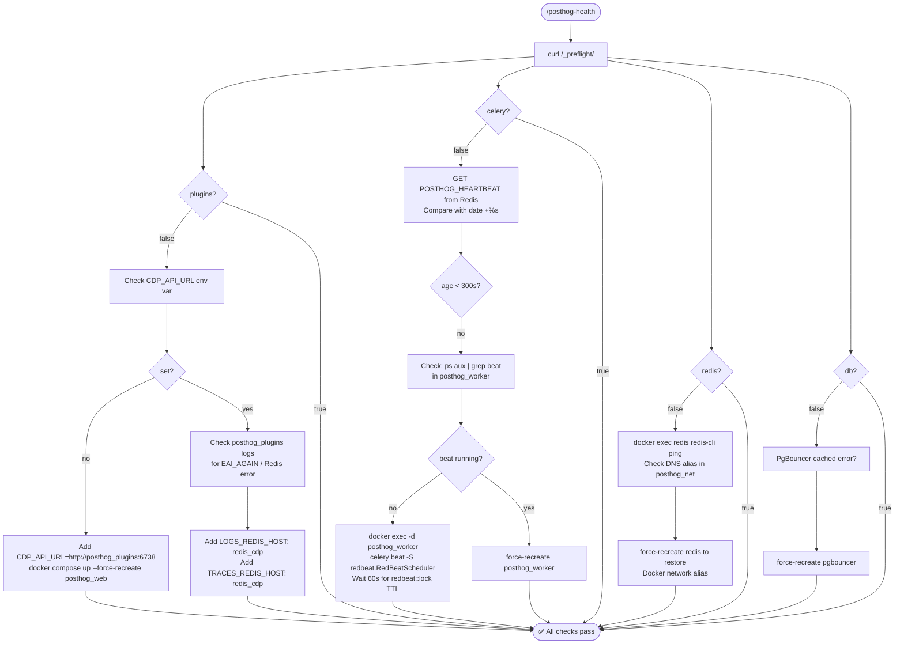
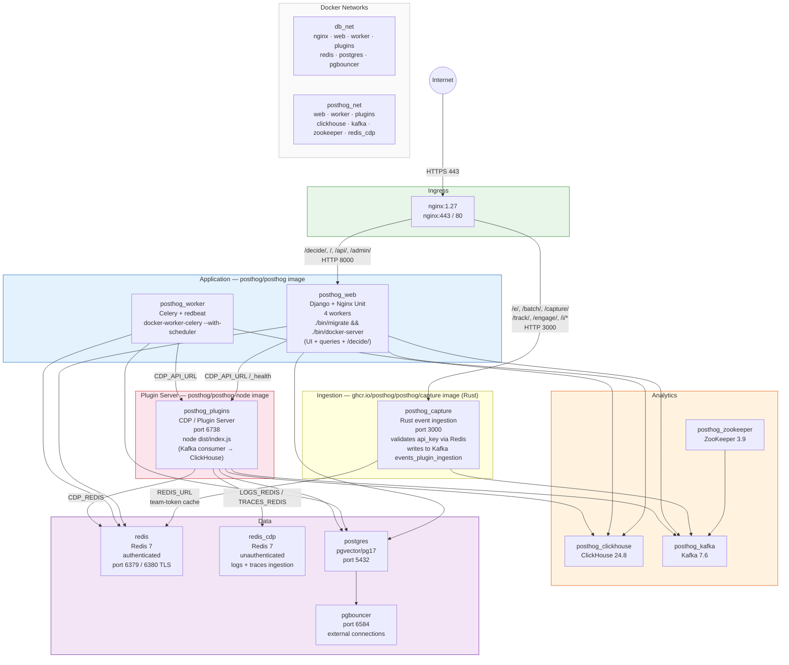
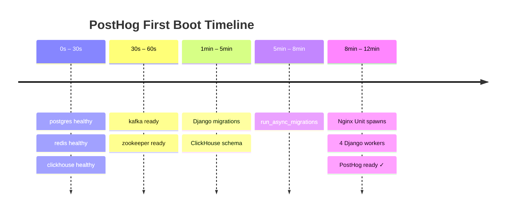

# 🦔 posthog-deploy-skill

> Claude Code slash commands for self-hosting PostHog with Docker Compose — battle-tested deployment knowledge packed into two commands.

[](https://www.npmjs.com/package/selfhog)
[](LICENSE)
[](https://claude.ai/code)
[](https://github.com/Ismail-Mirza/selfhog)

---

## What is this?

Self-hosting PostHog is powerful but full of hidden gotchas — wrong Redis configs, broken DNS aliases, Fernet key format traps, nginx IP caching, beat scheduler crashes. This package encodes all of that hard-won knowledge as two Claude Code slash commands you can use from any terminal.

```bash
npx selfhog
```

That's it. Two commands are now available in Claude Code:

| Command | What it does |
|---|---|
| `/deploy-posthog` | Full guided deployment on a fresh VPS — generates secrets, writes compose file (incl. capture-rs), handles TLS, explains every gotcha |
| `/posthog-health` | Diagnoses and fixes a running stack — checks all 7 preflight services + event ingestion (capture-rs) and gives exact fix commands |

---

## Install

```bash
# Run once to install the skills
npx selfhog

# Or install globally
npm install -g selfhog
```

Skills are copied to `~/.claude/commands/` and immediately available in any Claude Code session.

---

## Usage

### Deploy a fresh PostHog instance

Open Claude Code in your terminal and run:

```
/deploy-posthog
```

Claude will guide you through:

1. **Secrets generation** — including the tricky `ENCRYPTION_SALT_KEYS` format (32 raw UTF-8 chars, not base64)
2. **TLS setup** — certbot standalone certificate before nginx starts
3. **Full `docker-compose.yml`** — all 10 services wired up correctly
4. **Deployment** — `docker compose up -d` with correct startup order
5. **Health verification** — confirms all 7 preflight checks pass

---

### Diagnose a broken stack

```
/posthog-health
```

Checks every preflight service and provides exact fix commands:

```
=== Preflight ===
"django": true,
"redis": true,
"plugins": true,   ← was false without CDP_API_URL
"celery": true,    ← was false after beat scheduler crash
"clickhouse": true,
"kafka": true,
"db": true
```



---

## Architecture



---

## Key lessons encoded

These are the hard problems this skill solves — so you don't have to discover them yourself:

### 🔌 `CDP_API_URL` — the hidden plugin server config
PostHog's `is_plugin_server_alive()` calls `CDP_API_URL + "/_health"`. In production (non-debug, non-cloud) it defaults to a Kubernetes service URL that doesn't exist in self-hosted setups. Without this, `"plugins": false` forever.

```yaml
CDP_API_URL: http://posthog_plugins:6738
```

### 📦 Split images — `posthog/posthog` vs `posthog/posthog-node`
The `posthog/posthog` image's default `CMD` (`./bin/docker`) runs `bin/docker-worker` which tries to start the Node.js plugin server — but the Node.js code only exists in `posthog/posthog-node`. Result: endless crash loop every 2 seconds consuming CPU. Fix: override the command.

```yaml
command: bash -c "./bin/migrate && ./bin/docker-server"
```

### 🔑 `ENCRYPTION_SALT_KEYS` format trap
The plugin server does `Buffer.from(key, 'utf-8').toString('base64')` internally. If you pass a base64-encoded key, it double-encodes and Fernet rejects it. Use a raw 32-character string.

```bash
openssl rand -hex 16   # 32 hex chars = 32 UTF-8 bytes ✓
```

### 🌐 Static IP → reboot failures
Assigning `ipv4_address` to postgres causes other containers to grab that IP first on reboot. postgres can't start. Never use static IPs with Docker Compose — let Docker DNS handle it.

### 🥁 Beat scheduler crash & redbeat lock
After a force-recreate, the redbeat distributed lock in Redis may not be released. New beat instance waits for the TTL (~60s) before it can schedule tasks. The fix: start beat manually with `docker exec -d` and wait for the lock to expire.

### 🔁 Nginx IP caching after container recreation
When a container is recreated it gets a new IP. Nginx resolves hostnames at startup and caches them. A `nginx -s reload` re-resolves the hostname without dropping connections.

### 🔌 logs-ingestion hardcoded Redis host
The plugin server's logs-ingestion and traces-ingestion consumers hardcode `127.0.0.1:6379` as their Redis host. Override with a dedicated unauthenticated Redis (`redis_cdp`) via env vars.

### 🦀 capture-rs is mandatory — Django no longer routes `/batch/`
Modern PostHog (commit `edb2bdd4` and later, ~Sep 2024) **removed** `/e/`, `/batch/`, `/capture/`, `/i/v0/e/` from Django's URL config and moved them to a separate Rust service. Without it, every event POST falls through to Django's CSRF-guarded 404 view → `403 CSRF verification failed`. Even POSTs to non-existent paths return 403, which is the diagnostic fingerprint.

```yaml
posthog_capture:
  image: ghcr.io/posthog/posthog/capture:master  # ← note doubled "posthog/posthog"
  environment:
    KAFKA_TOPIC: events_plugin_ingestion          # plugin server consumes this
    CAPTURE_MODE: events
```

The image is **only** at `ghcr.io/posthog/posthog/capture` — no Docker Hub mirror, no `:latest` tag (use `:master`).

### 🛣️ nginx must route ingestion paths to capture-rs
Add a location block before the catch-all `/`:
```nginx
location ~ ^/(e|batch|capture|track|engage)/ { proxy_pass http://posthog_capture:3000; }
location /i/                                  { proxy_pass http://posthog_capture:3000; }
location /decide/                             { proxy_pass http://posthog_web:8000; }   # stays on Django
```

### 🔒 Django 4.x CSRF needs `CSRF_TRUSTED_ORIGINS`
Even after capture-rs handles ingestion, Django's `/decide/` and admin POSTs still require explicit trusted origins. Setting `SITE_URL` alone is not enough on Django 4.x:
```yaml
CSRF_TRUSTED_ORIGINS: https://${DOMAIN_POSTHOG}
ALLOWED_HOSTS: ${DOMAIN_POSTHOG},localhost,127.0.0.1
```

---

## Startup time expectations

| Phase | Duration |
|---|---|
| postgres / redis / clickhouse healthy | ~30s |
| kafka ready | ~60s |
| Django + ClickHouse migrations | 3–5 min |
| `run_async_migrations --complete-noop-migrations` | 1–3 min |
| Nginx Unit worker spawn (4 × ~90s) | 6–8 min |
| **Total — first boot** | **~12 min** |
| **Subsequent restarts** | **~4–6 min** |



---

## Requirements

- Node.js ≥ 18
- [Claude Code](https://claude.ai/code) CLI installed
- Target VPS: Ubuntu 22.04+, 8GB RAM minimum (16GB recommended for stability)
- Docker + Docker Compose plugin

---

## Contributing

Found a new PostHog self-hosting gotcha? PRs welcome.

1. Fork [Ismail-Mirza/selfhog](https://github.com/Ismail-Mirza/selfhog)
2. Add your fix to `skills/deploy-posthog.md` or `skills/posthog-health.md`
3. Open a pull request with a description of the failure mode

---

## Author

**Mohammad Ismail**

- 📧 [ismail.me.buet@gmail.com](mailto:ismail.me.buet@gmail.com)
- 🌐 [linkedin.com/in/ismail-mirza](https://www.linkedin.com/in/ismail-mirza/)
- 📘 [facebook.com/ismail.buet](https://www.facebook.com/ismail.buet)

---

## License

MIT © Mohammad Ismail
