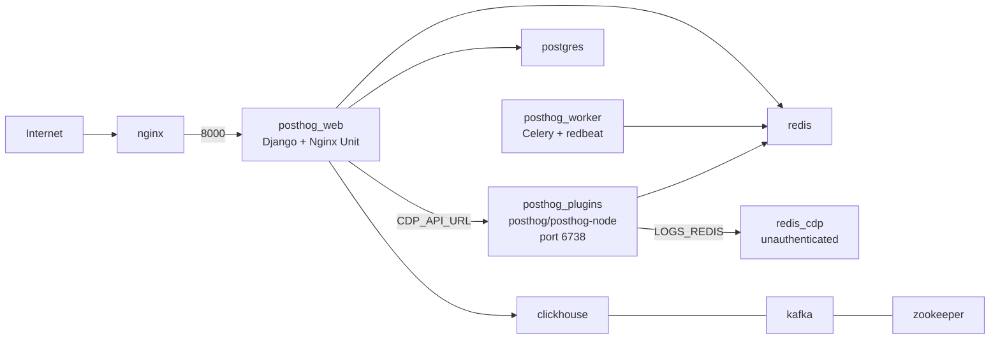

Self-hosting PostHog gives you full control over your analytics data. No third-party servers. No usage caps. No $450/month bills.

But the deployment docs skip over a lot. I learned that the hard way.

Here's every trap I hit — and the open-source tool I built to fix them.

---

## The Problem

PostHog's self-hosted setup looks deceptively simple: clone a repo, run `docker compose up`, done. In reality, you'll hit a wall of silent failures that the docs don't cover.

```
✅ Application database · Postgres    Validated
✅ Analytics database · ClickHouse    Validated
✅ Queue · Kafka                       Validated
✅ Backend server · Django             Validated
✅ Cache · Redis                       Validated
❌ Plugin server · Node                Error       ← stuck here for hours
✅ Frontend build · Vite               Validated
```

The preflight screen won't let you proceed until every check passes. And some of these failures are non-obvious.

---

## The 6 Traps Nobody Tells You About

### 1. `"plugins": false` — The Hidden Env Var

PostHog's Django health check calls `CDP_API_URL + "/_health"` to verify the plugin server. In production (non-cloud, non-debug), it defaults to a **Kubernetes service URL** that doesn't exist in Docker Compose:

```
http://ingestion-cdp-api.posthog.svc.cluster.local
```

Fix: one env var in your compose file.

```yaml
CDP_API_URL: http://posthog_plugins:6738
```

### 2. The Nodejs Crash Loop

The `posthog/posthog` image's default `CMD` runs `bin/docker-worker`, which tries to start the Node.js plugin server. But the Node.js code only lives in `posthog/posthog-node`. Result: a crash every 2 seconds consuming CPU and hiding real errors.

```
💥 Nodejs services crashed!
⌛️ Waiting 2 seconds before restarting...
💥 Nodejs services crashed!
```

Fix: override the command to skip the worker entirely.

```yaml
command: bash -c "./bin/migrate && ./bin/docker-server"
```

### 3. `ENCRYPTION_SALT_KEYS` Double-Encoding

The plugin server does this internally:

```js
Buffer.from(key, 'utf-8').toString('base64')
```

If you pass a base64-encoded key, it encodes it again and Fernet rejects it. The key must be **exactly 32 raw UTF-8 characters**.

```bash
openssl rand -hex 16  # 32 hex chars = 32 bytes ✓
```

### 4. Static IP → Reboot Failures

Assigning `ipv4_address` to postgres in your compose file causes another container to claim that IP first on reboot. Postgres can't bind and exits silently.

Fix: delete all `ipv4_address` entries. Docker DNS resolves hostnames automatically.

### 5. Beat Scheduler Crash After Recreation

The Celery beat scheduler uses a distributed lock in Redis (`redbeat::lock`). After a force-recreate, the old lock isn't released. The new beat instance spins waiting for the TTL to expire — meaning `POSTHOG_HEARTBEAT` goes stale and `"celery": false`.

Fix without restarting the whole worker:

```bash
docker exec -d posthog_worker /bin/bash -c \
  'cd /code && rm -f celerybeat.pid && celery -A posthog beat -S redbeat.RedBeatScheduler'
# Wait ~60s for lock TTL to expire
```

### 6. Nginx Caches Container IPs

When you force-recreate `posthog_web`, it gets a new Docker IP. Nginx resolved the old IP at startup and cached it — every request 502s until you reload.

```bash
docker exec periscale_nginx nginx -s reload
```

---

## The Architecture That Actually Works



Key insight: `posthog/posthog` and `posthog/posthog-node` are **separate images**. Don't mix them up.

---

## What I Built

I turned all of this into **selfhog** — a Claude Code skill package.

```bash
npx selfhog
```

This installs two slash commands into Claude Code:

| Command | Does |
|---|---|
| `/deploy-posthog` | Guided deployment with full compose template and all gotchas documented inline |
| `/posthog-health` | Diagnoses all 7 preflight checks and gives exact fix commands |

The health command runs a full diagnostic:

```
=== Preflight ===
"django":     true
"redis":      true
"plugins":    true   ← CDP_API_URL fixed
"celery":     true   ← beat scheduler restarted
"clickhouse": true
"kafka":      true
"db":         true
```

It's open source — contributions welcome at [github.com/Ismail-Mirza/selfhog](https://github.com/Ismail-Mirza/selfhog).

---

## Startup Reality Check

First boot is slow. Here's what to expect:

| Phase | Time |
|---|---|
| postgres + redis + clickhouse healthy | ~30s |
| kafka ready | ~60s |
| Django + ClickHouse migrations | 3–5 min |
| async migrations | 1–3 min |
| Nginx Unit spawns 4 workers | 6–8 min |
| **Total** | **~12 min** |

Don't restart it at 5 minutes thinking it's broken.

---

## TL;DR

Self-hosting PostHog is worth it — full data ownership, no limits, no vendor lock-in. But the default setup has sharp edges. Every problem above is now documented and fixable in under 2 minutes with `npx selfhog`.

---

*Mohammad Ismail — [LinkedIn](https://www.linkedin.com/in/ismail-mirza/) · [GitHub](https://github.com/Ismail-Mirza/selfhog) · [npm](https://www.npmjs.com/package/selfhog)*
